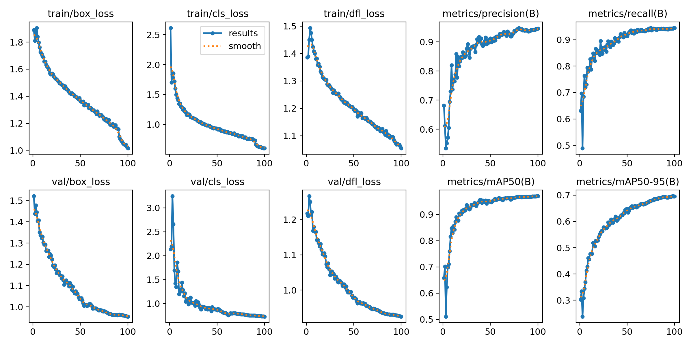
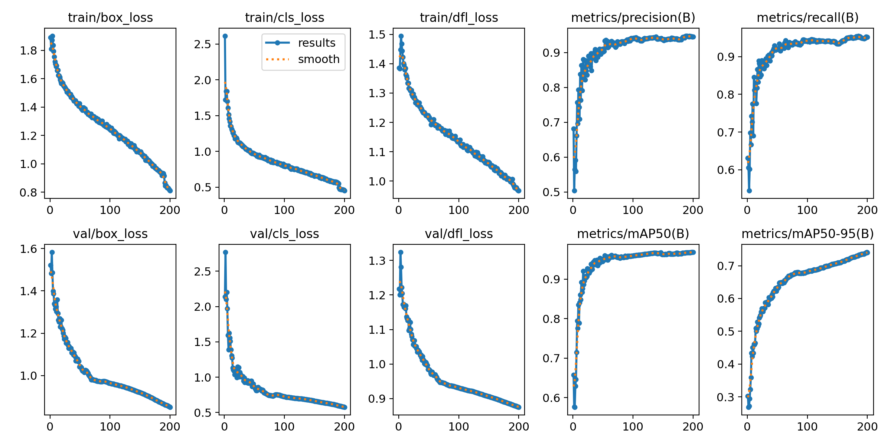
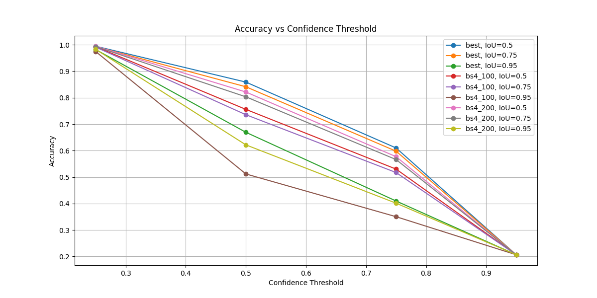
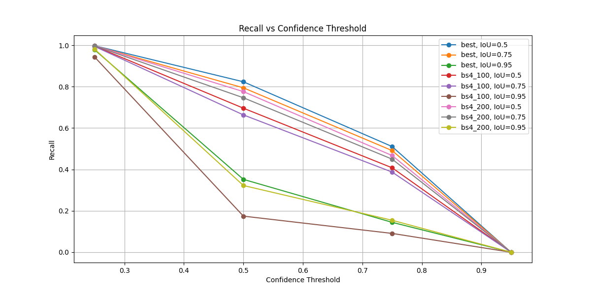

# 🚀 Drone Detection with YOLO11

Welcome to the Drone Detection project using YOLO11! This project aims to detect objects such as Airplanes, Drones, and Helicopters in images. We use a YOLO11 model trained on a NVIDIA GeForce RTX 4060.

## 📋 Table of Contents
- [Project Description](#-project-description)
- [Files](#-files)
- [Usage](#-usage)
- [Results](#-results)
- [Conclusion](#-conclusion)
- [Additional Recommendations](#-additional-recommendations)

## 📝 Project Description
This project focuses on detecting various types of aerial vehicles (Airplanes, Drones, Helicopters) using the YOLO11 model. The dataset used for training and testing can be found [here](https://www.kaggle.com/datasets/cybersimar08/drone-detection/data).

## 📂 Files

### 🔧 Configuration
- **configuration.py**: This file contains all the necessary configurations for the project, including model parameters, paths to data files, and other settings required for the smooth operation of the project.

### 📊 Dataset Preparation
- **make_dataset.py**: This script is responsible for preparing and generating the dataset for training and testing. It includes functions to load, preprocess, and split the dataset into training and testing sets.

### 🔄 Training
- **train_model.py**: This script is used to train the YOLO11 model on the prepared dataset. It includes functions to load the dataset, define the model architecture, train the model, and save the trained model to disk.

### 📈 Analysis
- **analyze_results.py**: This script is used to analyze the results of the model. It includes functions to load the trained model, make predictions on the test set, and calculate metrics such as precision, recall, and dice score.

### 🛠️ Utilities
- **tools.py**: This file contains utility functions that are used across different scripts. These functions include data loading, data preprocessing, model evaluation, and visualization functions.

### 🔮 Prediction
- **predict.py**: This script is used to make predictions on new images using the trained YOLO11 model. It includes functions to load the trained model, preprocess new images, make predictions, and visualize the results.

## 🛠️ Usage
To get started with this project, follow these steps:

1. **Clone the Repository:**
   Clone the repository to your local machine using the following command:
   ```
   $ git clone https://github.com/BatBapt/aerial_detection
   $ cd aerial_detection
   ```

2. **Download the Dataset:**
   Download the dataset from [Kaggle](https://www.kaggle.com/datasets/cybersimar08/drone-detection/data) and place it in the appropriate directory within the project.

3. **Set Up Configuration:**
   Update the `configuration.py` file with the appropriate paths to the dataset and any other necessary configurations.

4. **Prepare the Dataset:**
   Run the `make_dataset.py` script to prepare the dataset for training and testing:
   ```
   $ python make_dataset.py
   ```

5. **Train the Model:**
   Use the `train_model.py` script to train the YOLO11 model on the prepared dataset.
   The first time you call the script, it will download the pre-trained weights for YOLO11:
   ```
   $ python train_model.py
   ```
   
6. **Make Predictions:**
   Use the `predict.py` script to make predictions on validation dataset:
   ```
   $ python predict.py
   ```

7. **Analyze Results:**
   After training, use the `analyze_results.py` script to evaluate the model's performance:
   ```
   $ python analyze_results.py
   ```

## 📊 Training plots
Here you will find training plots such as loss curves, precision-recall curves, and other relevant visualizations generated during the training process.

### Training Results for the BS8_100 Model


### Training Results for the BS4_100 Model


### Training Results for the BS4_200 Model


## 📊 Results








Here you will find the results of the model training and evaluation. The metrics include F1-score, Intersection over Union (IoU), and Recall at different confidence thresholds.

| Model   | Advantages                                   | Disadvantages                           | Best Use Case                           |
|---------|----------------------------------------------|-----------------------------------------|-----------------------------------------|
| bs8_100 | High F1-score and IoU, stable recall         | Slightly less precise at high threshold | General detection, balanced performance |
| bs4_100 | Good compromise between precision and recall | Slightly lower performance than best    | Cost-performance balance                |
| bs4_200 | Less performant on all metrics               | Early drop in F1, IoU, and recall       | Avoid unless specific constraint        |


### 🏆 Conclusion

**Best Model: best (IoU=0.5 or 0.75) 🌟**
- **Why?**
  - Highest F1-score and IoU at all confidence thresholds. 📈
  - Superior recall and accuracy, especially at low/medium thresholds. 🎯
  - Stable metrics up to a confidence threshold of 0.7-0.8. 📊

- **Ideal Use Case:**
  - Applications requiring a good balance between precision and recall (e.g., critical object detection where false negatives are costly). 🚨
  - Scenarios where the confidence threshold can be adjusted between 0.4 and 0.7 to optimize metrics. ⚖️

### 💡 Additional Recommendations
- **Optimal Confidence Threshold:** Between 0.4 and 0.6 to maximize F1-score and IoU. 🎯
- **Recommended IoU:** 0.5 or 0.75 for best and bs4_100. 🏆
- **Avoid bs4_200** unless hardware constraints demand it, as its performance is consistently lower. ❌

---

Stay tuned for more updates and happy detecting! 🚁✈️🛩️

<small>This project was enhanced with the help of my Mistral AI Agent.</small>
